# Nomiso IntelliQ - Workflow Documentation

This document provides comprehensive documentation of the workflow processes, state management, and workflow orchestration in the Nomiso IntelliQ platform.

## Table of Contents

1. [Workflow Overview](#workflow-overview)
2. [Core Workflow Architecture](#core-workflow-architecture)
3. [Story Processing Workflow](#story-processing-workflow)
4. [Test Case Generation Workflow](#test-case-generation-workflow)
5. [Validation Workflow](#validation-workflow)
6. [Workflow State Management](#workflow-state-management)
7. [Error Handling and Recovery](#error-handling-and-recovery)
8. [Workflow Monitoring and Metrics](#workflow-monitoring-and-metrics)
9. [Workflow Configuration](#workflow-configuration)
10. [Workflow Extensions](#workflow-extensions)

## Workflow Overview

The Nomiso IntelliQ platform uses a sophisticated workflow management system built on LangGraph that orchestrates the entire process of story enhancement, test case generation, and validation. The workflow system provides:

- **State-based Processing**: Each workflow step maintains and updates state
- **Retry Logic**: Automatic retry mechanisms for failed operations
- **Parallel Processing**: Concurrent execution of independent tasks
- **Error Recovery**: Graceful handling of failures and edge cases
- **Monitoring**: Real-time tracking of workflow progress and performance

### Workflow Types

1. **Story Enhancement Workflow**: Main workflow for processing and enhancing user stories
2. **Test Case Generation Workflow**: Workflow for generating and validating test cases
3. **Validation Workflow**: Quality assurance and accuracy measurement workflow
4. **Integration Workflow**: JIRA and external system integration workflows

## Core Workflow Architecture

### Workflow Manager Structure

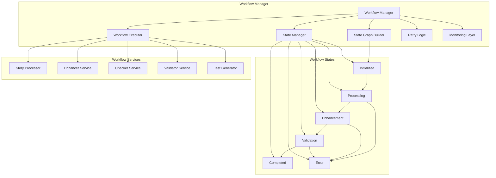
```mermaid
graph TB
    subgraph "Workflow Manager"
        WM[Workflow Manager]
        SG[State Graph Builder]
        WE[Workflow Executor]
        SM[State Manager]
        RL[Retry Logic]
        ML[Monitoring Layer]
    end
    
    subgraph "Workflow States"
        S1[Initialized]
        S2[Processing]
        S3[Enhancement]
        S4[Validation]
        S5[Completed]
        S6[Error]
    end
    
    subgraph "Workflow Services"
        WS1[Story Processor]
        WS2[Enhancer Service]
        WS3[Checker Service]
        WS4[Validator Service]
        WS5[Test Generator]
    end
    
    WM --> SG
    WM --> WE
    WM --> SM
    WM --> RL
    WM --> ML
    
    SG --> S1
    S1 --> S2
    S2 --> S3
    S3 --> S4
    S4 --> S5
    S2 --> S6
    S3 --> S6
    S4 --> S6
    
    WE --> WS1
    WE --> WS2
    WE --> WS3
    WE --> WS4
    WE --> WS5
    
    SM --> S1
    SM --> S2
    SM --> S3
    SM --> S4
    SM --> S5
    SM --> S6
```

### Workflow Execution Flow

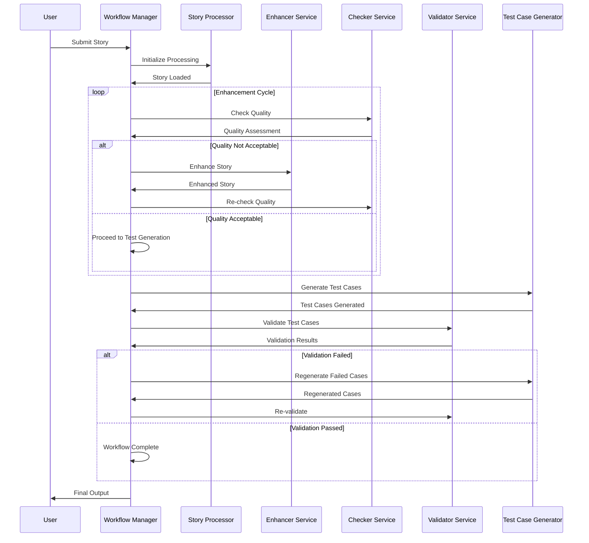
```mermaid
sequenceDiagram
    participant U as User
    participant WM as Workflow Manager
    participant SP as Story Processor
    participant ES as Enhancer Service
    participant CS as Checker Service
    participant VS as Validator Service
    participant TC as Test Case Generator
    
    U->>WM: Submit Story
    WM->>SP: Initialize Processing
    SP->>WM: Story Loaded
    
    loop Enhancement Cycle
        WM->>CS: Check Quality
        CS->>WM: Quality Assessment
        alt Quality Not Acceptable
            WM->>ES: Enhance Story
            ES->>WM: Enhanced Story
            WM->>CS: Re-check Quality
        else Quality Acceptable
            WM->>WM: Proceed to Test Generation
        end
    end
    
    WM->>TC: Generate Test Cases
    TC->>WM: Test Cases Generated
    WM->>VS: Validate Test Cases
    VS->>WM: Validation Results
    
    alt Validation Failed
        WM->>TC: Regenerate Failed Cases
        TC->>WM: Regenerated Cases
        WM->>VS: Re-validate
    else Validation Passed
        WM->>WM: Workflow Complete
    end
    
    WM->>U: Final Output
```

## Story Processing Workflow

### Primary Story Processing Flow

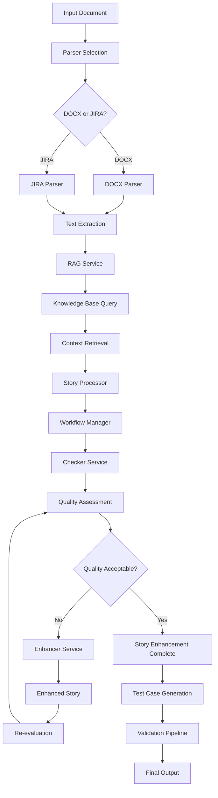
```mermaid
graph TD
    A[Input Document] --> B[Parser Selection]
    B --> C{DOCX or JIRA?}
    C -->|DOCX| D[DOCX Parser]
    C -->|JIRA| E[JIRA Parser]
    D --> F[Text Extraction]
    E --> F
    F --> G[RAG Service]
    G --> H[Knowledge Base Query]
    H --> I[Context Retrieval]
    I --> J[Story Processor]
    J --> K[Workflow Manager]
    K --> L[Checker Service]
    L --> M[Quality Assessment]
    M --> N{Quality Acceptable?}
    N -->|No| O[Enhancer Service]
    N -->|Yes| P[Story Enhancement Complete]
    O --> Q[Enhanced Story]
    Q --> R[Re-evaluation]
    R --> M
    P --> S[Test Case Generation]
    S --> T[Validation Pipeline]
    T --> U[Final Output]
```

### Story Enhancement Iteration Process

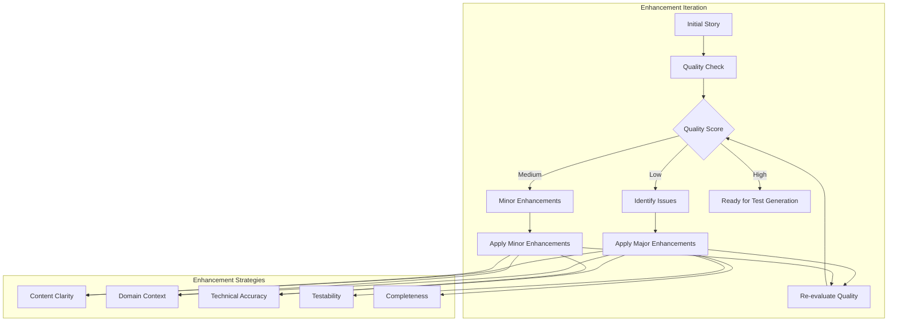
```mermaid
graph TD
    subgraph "Enhancement Iteration"
        A1[Initial Story] --> B1[Quality Check]
        B1 --> C1{Quality Score}
        C1 -->|Low| D1[Identify Issues]
        C1 -->|Medium| E1[Minor Enhancements]
        C1 -->|High| F1[Ready for Test Generation]
        
        D1 --> G1[Apply Major Enhancements]
        E1 --> H1[Apply Minor Enhancements]
        
        G1 --> I1[Re-evaluate Quality]
        H1 --> I1
        
        I1 --> C1
    end
    
    subgraph "Enhancement Strategies"
        ES1[Content Clarity]
        ES2[Domain Context]
        ES3[Technical Accuracy]
        ES4[Testability]
        ES5[Completeness]
    end
    
    G1 --> ES1
    G1 --> ES2
    G1 --> ES3
    G1 --> ES4
    G1 --> ES5
    
    H1 --> ES1
    H1 --> ES2
    H1 --> ES3
```

### RAG Context Integration Workflow

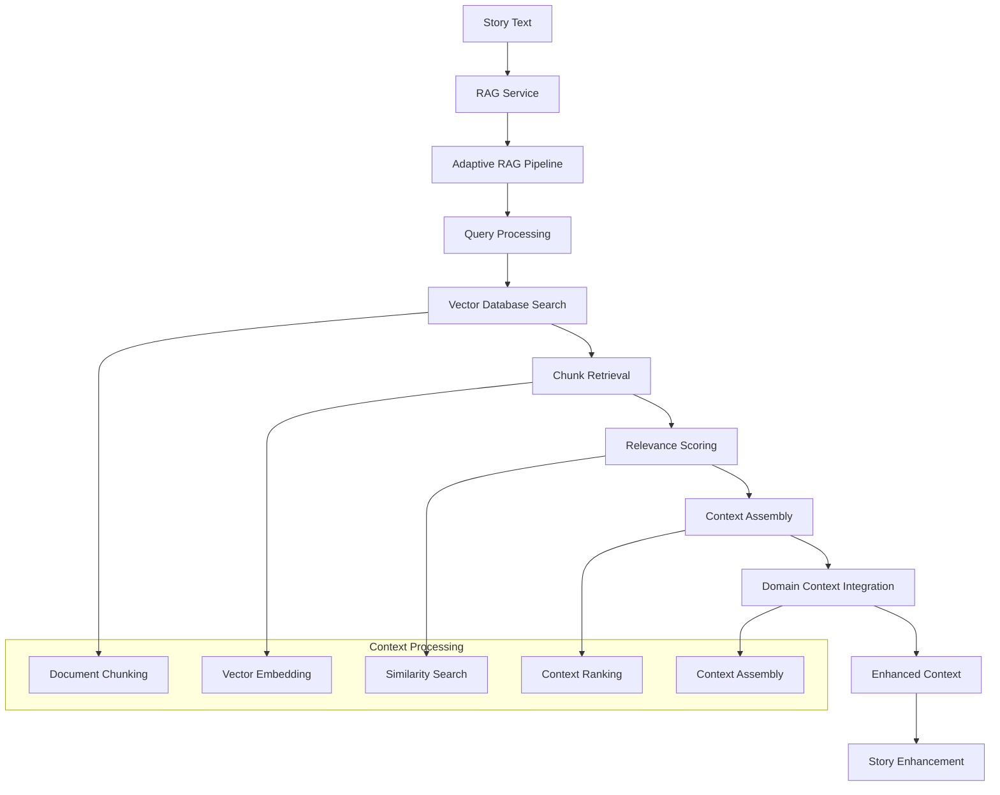
```mermaid
graph TD
    A[Story Text] --> B[RAG Service]
    B --> C[Adaptive RAG Pipeline]
    C --> D[Query Processing]
    D --> E[Vector Database Search]
    E --> F[Chunk Retrieval]
    F --> G[Relevance Scoring]
    G --> H[Context Assembly]
    H --> I[Domain Context Integration]
    I --> J[Enhanced Context]
    J --> K[Story Enhancement]
    
    subgraph "Context Processing"
        CP1[Document Chunking]
        CP2[Vector Embedding]
        CP3[Similarity Search]
        CP4[Context Ranking]
        CP5[Context Assembly]
    end
    
    E --> CP1
    F --> CP2
    G --> CP3
    H --> CP4
    I --> CP5
```

## Test Case Generation Workflow

### Test Case Generation Pipeline

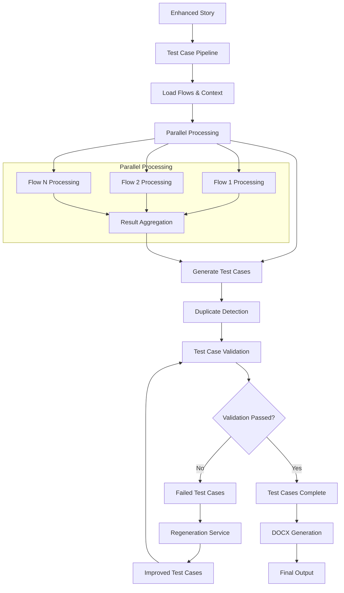
```mermaid
graph TD
    A[Enhanced Story] --> B[Test Case Pipeline]
    B --> C[Load Flows & Context]
    C --> D[Parallel Processing]
    D --> E[Generate Test Cases]
    E --> F[Duplicate Detection]
    F --> G[Test Case Validation]
    G --> H{Validation Passed?}
    H -->|No| I[Failed Test Cases]
    H -->|Yes| J[Test Cases Complete]
    I --> K[Regeneration Service]
    K --> L[Improved Test Cases]
    L --> G
    J --> M[DOCX Generation]
    M --> N[Final Output]
    
    subgraph "Parallel Processing"
        PP1[Flow 1 Processing]
        PP2[Flow 2 Processing]
        PP3[Flow N Processing]
        PP4[Result Aggregation]
    end
    
    D --> PP1
    D --> PP2
    D --> PP3
    PP1 --> PP4
    PP2 --> PP4
    PP3 --> PP4
    PP4 --> E
```

### Test Case Validation Workflow

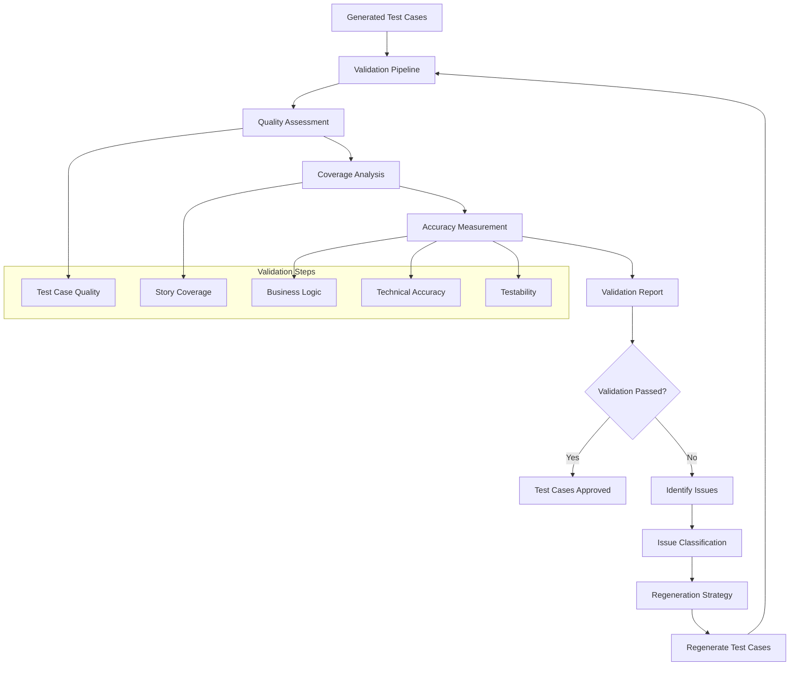
```mermaid
graph TD
    A[Generated Test Cases] --> B[Validation Pipeline]
    B --> C[Quality Assessment]
    C --> D[Coverage Analysis]
    D --> E[Accuracy Measurement]
    E --> F[Validation Report]
    
    subgraph "Validation Steps"
        VS1[Test Case Quality]
        VS2[Story Coverage]
        VS3[Business Logic]
        VS4[Technical Accuracy]
        VS5[Testability]
    end
    
    C --> VS1
    D --> VS2
    E --> VS3
    E --> VS4
    E --> VS5
    
    F --> G{Validation Passed?}
    G -->|Yes| H[Test Cases Approved]
    G -->|No| I[Identify Issues]
    
    I --> J[Issue Classification]
    J --> K[Regeneration Strategy]
    K --> L[Regenerate Test Cases]
    L --> B
```

### Failed Test Case Regeneration Workflow

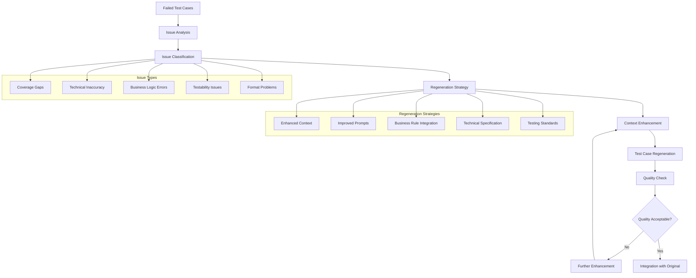
```mermaid
graph TD
    A[Failed Test Cases] --> B[Issue Analysis]
    B --> C[Issue Classification]
    C --> D[Regeneration Strategy]
    D --> E[Context Enhancement]
    E --> F[Test Case Regeneration]
    F --> G[Quality Check]
    G --> H{Quality Acceptable?}
    H -->|No| I[Further Enhancement]
    H -->|Yes| J[Integration with Original]
    
    I --> E
    
    subgraph "Issue Types"
        IT1[Coverage Gaps]
        IT2[Technical Inaccuracy]
        IT3[Business Logic Errors]
        IT4[Testability Issues]
        IT5[Format Problems]
    end
    
    C --> IT1
    C --> IT2
    C --> IT3
    C --> IT4
    C --> IT5
    
    subgraph "Regeneration Strategies"
        RS1[Enhanced Context]
        RS2[Improved Prompts]
        RS3[Business Rule Integration]
        RS4[Technical Specification]
        RS5[Testing Standards]
    end
    
    D --> RS1
    D --> RS2
    D --> RS3
    D --> RS4
    D --> RS5
```

## Validation Workflow

### Multi-Iteration Validation Process

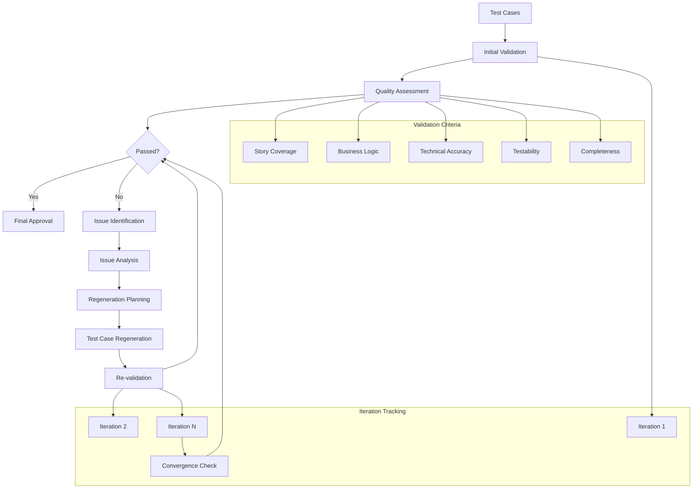
```mermaid
graph TD
    A[Test Cases] --> B[Initial Validation]
    B --> C[Quality Assessment]
    C --> D{Passed?}
    D -->|Yes| E[Final Approval]
    D -->|No| F[Issue Identification]
    
    F --> G[Issue Analysis]
    G --> H[Regeneration Planning]
    H --> I[Test Case Regeneration]
    I --> J[Re-validation]
    J --> D
    
    subgraph "Validation Criteria"
        VC1[Story Coverage]
        VC2[Business Logic]
        VC3[Technical Accuracy]
        VC4[Testability]
        VC5[Completeness]
    end
    
    C --> VC1
    C --> VC2
    C --> VC3
    C --> VC4
    C --> VC5
    
    subgraph "Iteration Tracking"
        IT1[Iteration 1]
        IT2[Iteration 2]
        IT3[Iteration N]
        IT4[Convergence Check]
    end
    
    B --> IT1
    J --> IT2
    J --> IT3
    IT3 --> IT4
    IT4 --> D
```

### Accuracy Measurement Workflow

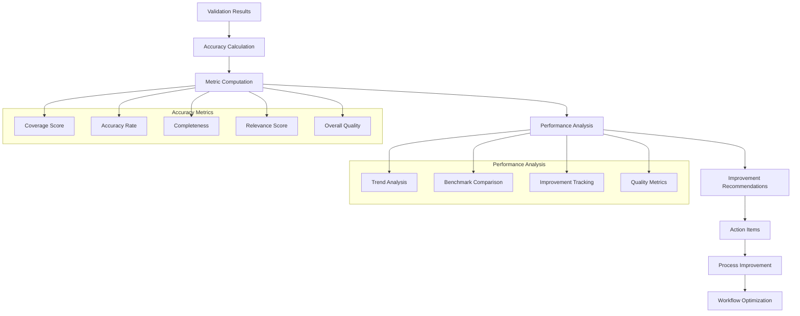
```mermaid
graph TD
    A[Validation Results] --> B[Accuracy Calculation]
    B --> C[Metric Computation]
    C --> D[Performance Analysis]
    D --> E[Improvement Recommendations]
    
    subgraph "Accuracy Metrics"
        AM1[Coverage Score]
        AM2[Accuracy Rate]
        AM3[Completeness]
        AM4[Relevance Score]
        AM5[Overall Quality]
    end
    
    C --> AM1
    C --> AM2
    C --> AM3
    C --> AM4
    C --> AM5
    
    subgraph "Performance Analysis"
        PA1[Trend Analysis]
        PA2[Benchmark Comparison]
        PA3[Improvement Tracking]
        PA4[Quality Metrics]
    end
    
    D --> PA1
    D --> PA2
    D --> PA3
    D --> PA4
    
    E --> F[Action Items]
    F --> G[Process Improvement]
    G --> H[Workflow Optimization]
```

## Workflow State Management

### State Transition Diagram

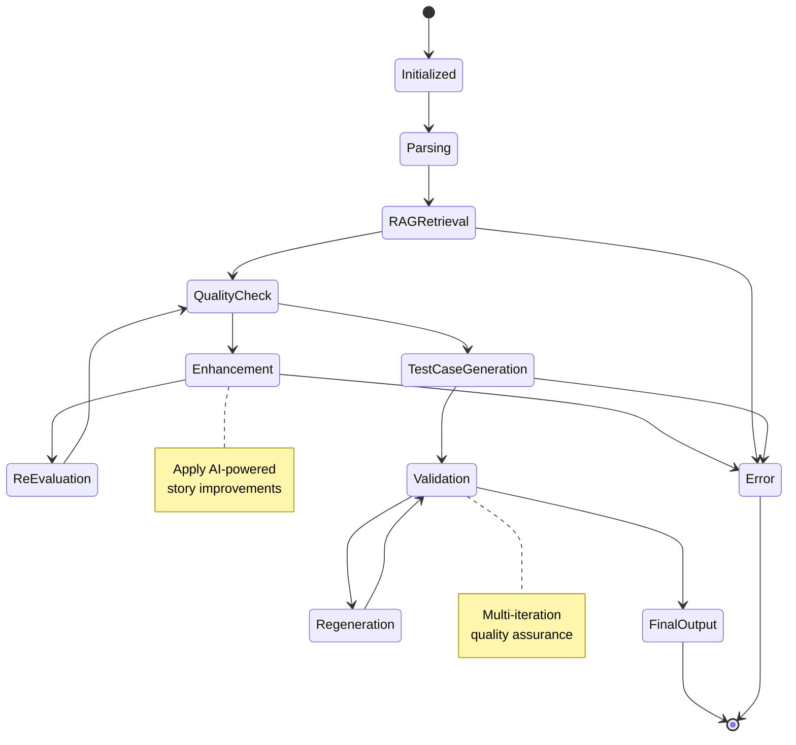
```mermaid
stateDiagram-v2
    [*] --> Initialized
    Initialized --> Parsing
    Parsing --> RAGRetrieval
    RAGRetrieval --> QualityCheck
    QualityCheck --> Enhancement
    Enhancement --> ReEvaluation
    ReEvaluation --> QualityCheck
    QualityCheck --> TestCaseGeneration
    TestCaseGeneration --> Validation
    Validation --> Regeneration
    Regeneration --> Validation
    Validation --> FinalOutput
    FinalOutput --> [*]
    
    Enhancement --> Error
    RAGRetrieval --> Error
    TestCaseGeneration --> Error
    Error --> [*]
    
    note right of Enhancement
        Apply AI-powered
        story improvements
    end note
    
    note right of Validation
        Multi-iteration
        quality assurance
    end note
```

### State Data Structure

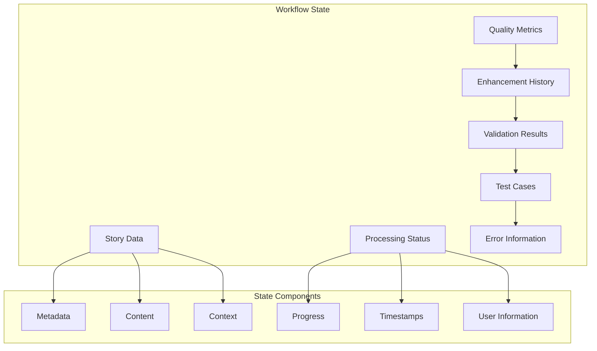
```mermaid
graph TD
    subgraph "Workflow State"
        WS1[Story Data]
        WS2[Processing Status]
        WS3[Quality Metrics]
        WS4[Enhancement History]
        WS5[Validation Results]
        WS6[Test Cases]
        WS7[Error Information]
    end
    
    subgraph "State Components"
        SC1[Metadata]
        SC2[Content]
        SC3[Context]
        SC4[Progress]
        SC5[Timestamps]
        SC6[User Information]
    end
    
    WS1 --> SC1
    WS1 --> SC2
    WS1 --> SC3
    WS2 --> SC4
    WS2 --> SC5
    WS2 --> SC6
    
    WS3 --> WS4
    WS4 --> WS5
    WS5 --> WS6
    WS6 --> WS7
```

## Error Handling and Recovery

### Error Handling Workflow

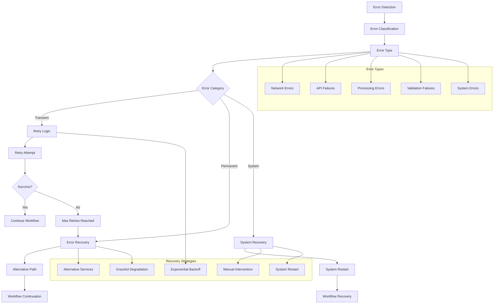
```mermaid
graph TD
    A[Error Detection] --> B[Error Classification]
    B --> C[Error Type]
    C --> D{Error Category}
    
    D -->|Transient| E[Retry Logic]
    D -->|Permanent| F[Error Recovery]
    D -->|System| G[System Recovery]
    
    E --> H[Retry Attempt]
    H --> I{Success?}
    I -->|Yes| J[Continue Workflow]
    I -->|No| K[Max Retries Reached]
    
    K --> F
    F --> L[Alternative Path]
    L --> M[Workflow Continuation]
    
    G --> N[System Restart]
    N --> O[Workflow Recovery]
    
    subgraph "Error Types"
        ET1[Network Errors]
        ET2[API Failures]
        ET3[Processing Errors]
        ET4[Validation Failures]
        ET5[System Errors]
    end
    
    C --> ET1
    C --> ET2
    C --> ET3
    C --> ET4
    C --> ET5
    
    subgraph "Recovery Strategies"
        RS1[Exponential Backoff]
        RS2[Alternative Services]
        RS3[Graceful Degradation]
        RS4[Manual Intervention]
        RS5[System Restart]
    end
    
    E --> RS1
    F --> RS2
    F --> RS3
    G --> RS4
    G --> RS5
```

### Retry Logic Implementation

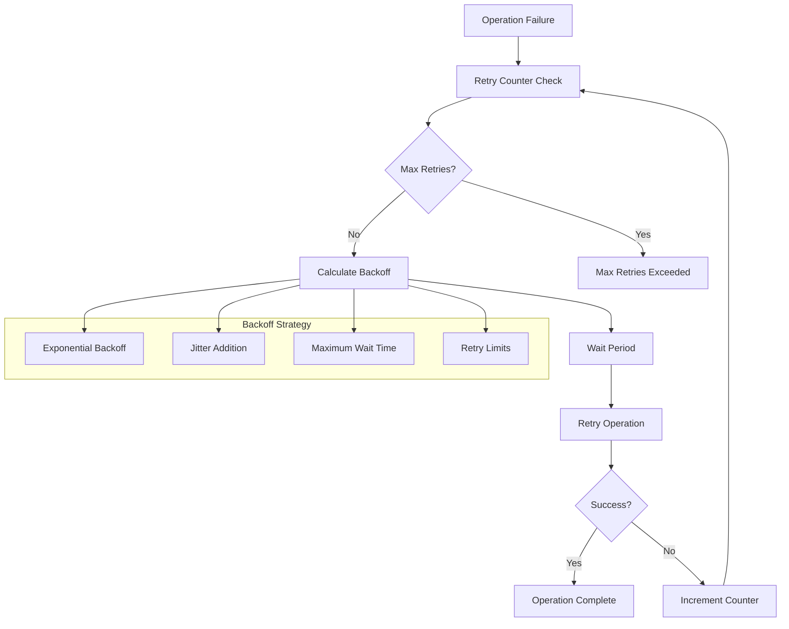
```mermaid
graph TD
    A[Operation Failure] --> B[Retry Counter Check]
    B --> C{Max Retries?}
    C -->|No| D[Calculate Backoff]
    C -->|Yes| E[Max Retries Exceeded]
    
    D --> F[Wait Period]
    F --> G[Retry Operation]
    G --> H{Success?}
    H -->|Yes| I[Operation Complete]
    H -->|No| J[Increment Counter]
    
    J --> B
    
    subgraph "Backoff Strategy"
        BS1[Exponential Backoff]
        BS2[Jitter Addition]
        BS3[Maximum Wait Time]
        BS4[Retry Limits]
    end
    
    D --> BS1
    D --> BS2
    D --> BS3
    D --> BS4
```

## Workflow Monitoring and Metrics

### Monitoring Dashboard

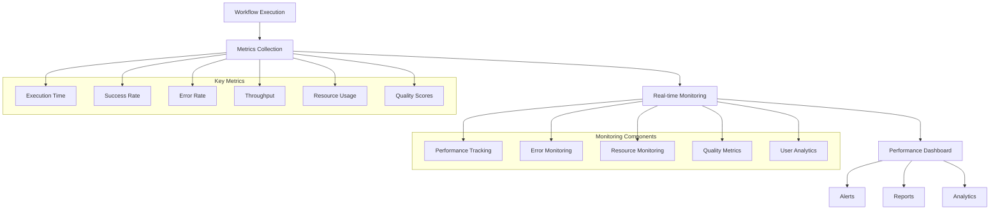
```mermaid
graph TD
    A[Workflow Execution] --> B[Metrics Collection]
    B --> C[Real-time Monitoring]
    C --> D[Performance Dashboard]
    
    subgraph "Key Metrics"
        KM1[Execution Time]
        KM2[Success Rate]
        KM3[Error Rate]
        KM4[Throughput]
        KM5[Resource Usage]
        KM6[Quality Scores]
    end
    
    B --> KM1
    B --> KM2
    B --> KM3
    B --> KM4
    B --> KM5
    B --> KM6
    
    subgraph "Monitoring Components"
        MC1[Performance Tracking]
        MC2[Error Monitoring]
        MC3[Resource Monitoring]
        MC4[Quality Metrics]
        MC5[User Analytics]
    end
    
    C --> MC1
    C --> MC2
    C --> MC3
    C --> MC4
    C --> MC5
    
    D --> E[Alerts]
    D --> F[Reports]
    D --> G[Analytics]
```

### Performance Tracking

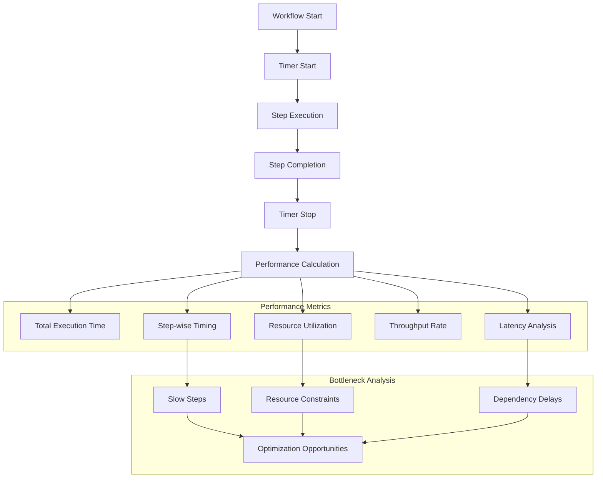
```mermaid
graph TD
    A[Workflow Start] --> B[Timer Start]
    B --> C[Step Execution]
    C --> D[Step Completion]
    D --> E[Timer Stop]
    E --> F[Performance Calculation]
    
    subgraph "Performance Metrics"
        PM1[Total Execution Time]
        PM2[Step-wise Timing]
        PM3[Resource Utilization]
        PM4[Throughput Rate]
        PM5[Latency Analysis]
    end
    
    F --> PM1
    F --> PM2
    F --> PM3
    F --> PM4
    F --> PM5
    
    subgraph "Bottleneck Analysis"
        BA1[Slow Steps]
        BA2[Resource Constraints]
        BA3[Dependency Delays]
        BA4[Optimization Opportunities]
    end
    
    PM2 --> BA1
    PM3 --> BA2
    PM5 --> BA3
    BA1 --> BA4
    BA2 --> BA4
    BA3 --> BA4
```

## Workflow Configuration

### Configuration Management

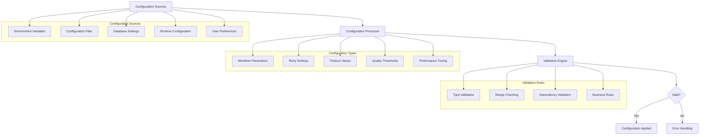
```mermaid
graph TD
    A[Configuration Sources] --> B[Configuration Processor]
    B --> C[Validation Engine]
    C --> D{Valid?}
    D -->|Yes| E[Configuration Applied]
    D -->|No| F[Error Handling]
    
    subgraph "Configuration Sources"
        CS1[Environment Variables]
        CS2[Configuration Files]
        CS3[Database Settings]
        CS4[Runtime Configuration]
        CS5[User Preferences]
    end
    
    A --> CS1
    A --> CS2
    A --> CS3
    A --> CS4
    A --> CS5
    
    subgraph "Configuration Types"
        CT1[Workflow Parameters]
        CT2[Retry Settings]
        CT3[Timeout Values]
        CT4[Quality Thresholds]
        CT5[Performance Tuning]
    end
    
    B --> CT1
    B --> CT2
    B --> CT3
    B --> CT4
    B --> CT5
    
    subgraph "Validation Rules"
        VR1[Type Validation]
        VR2[Range Checking]
        VR3[Dependency Validation]
        VR4[Business Rules]
    end
    
    C --> VR1
    C --> VR2
    C --> VR3
    C --> VR4
```

### Dynamic Configuration Updates

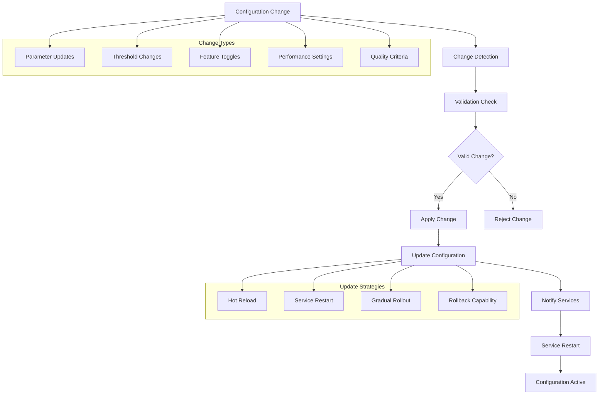
```mermaid
graph TD
    A[Configuration Change] --> B[Change Detection]
    B --> C[Validation Check]
    C --> D{Valid Change?}
    D -->|Yes| E[Apply Change]
    D -->|No| F[Reject Change]
    
    E --> G[Update Configuration]
    G --> H[Notify Services]
    H --> I[Service Restart]
    I --> J[Configuration Active]
    
    subgraph "Change Types"
        CT1[Parameter Updates]
        CT2[Threshold Changes]
        CT3[Feature Toggles]
        CT4[Performance Settings]
        CT5[Quality Criteria]
    end
    
    A --> CT1
    A --> CT2
    A --> CT3
    A --> CT4
    A --> CT5
    
    subgraph "Update Strategies"
        US1[Hot Reload]
        US2[Service Restart]
        US3[Gradual Rollout]
        US4[Rollback Capability]
    end
    
    G --> US1
    G --> US2
    G --> US3
    G --> US4
```

## Workflow Extensions

### Plugin Architecture

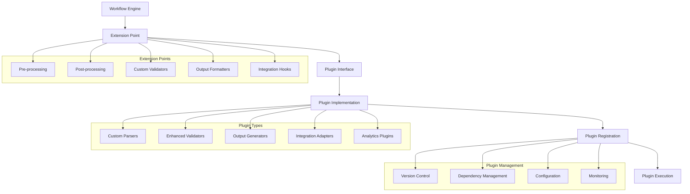
```mermaid
graph TD
    A[Workflow Engine] --> B[Extension Point]
    B --> C[Plugin Interface]
    C --> D[Plugin Implementation]
    D --> E[Plugin Registration]
    E --> F[Plugin Execution]
    
    subgraph "Extension Points"
        EP1[Pre-processing]
        EP2[Post-processing]
        EP3[Custom Validators]
        EP4[Output Formatters]
        EP5[Integration Hooks]
    end
    
    B --> EP1
    B --> EP2
    B --> EP3
    B --> EP4
    B --> EP5
    
    subgraph "Plugin Types"
        PT1[Custom Parsers]
        PT2[Enhanced Validators]
        PT3[Output Generators]
        PT4[Integration Adapters]
        PT5[Analytics Plugins]
    end
    
    D --> PT1
    D --> PT2
    D --> PT3
    D --> PT4
    D --> PT5
    
    subgraph "Plugin Management"
        PM1[Version Control]
        PM2[Dependency Management]
        PM3[Configuration]
        PM4[Monitoring]
    end
    
    E --> PM1
    E --> PM2
    E --> PM3
    E --> PM4
```

### Custom Workflow Definitions

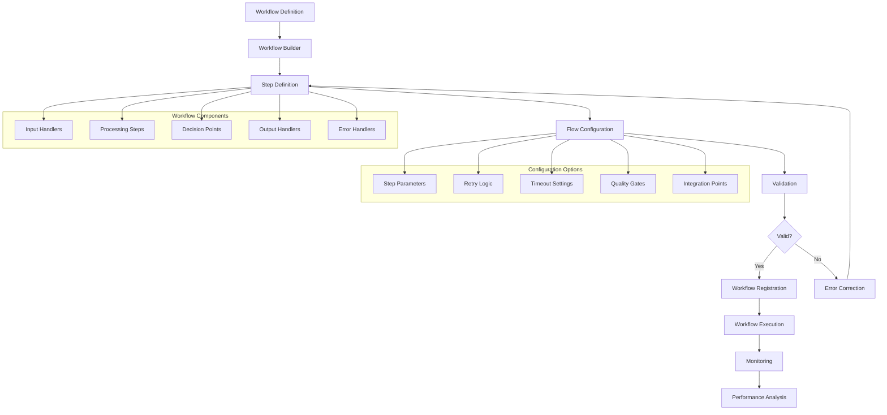
```mermaid
graph TD
    A[Workflow Definition] --> B[Workflow Builder]
    B --> C[Step Definition]
    C --> D[Flow Configuration]
    D --> E[Validation]
    E --> F{Valid?}
    F -->|Yes| G[Workflow Registration]
    F -->|No| H[Error Correction]
    
    H --> C
    
    subgraph "Workflow Components"
        WC1[Input Handlers]
        WC2[Processing Steps]
        WC3[Decision Points]
        WC4[Output Handlers]
        WC5[Error Handlers]
    end
    
    C --> WC1
    C --> WC2
    C --> WC3
    C --> WC4
    C --> WC5
    
    subgraph "Configuration Options"
        CO1[Step Parameters]
        CO2[Retry Logic]
        CO3[Timeout Settings]
        CO4[Quality Gates]
        CO5[Integration Points]
    end
    
    D --> CO1
    D --> CO2
    D --> CO3
    D --> CO4
    D --> CO5
    
    G --> I[Workflow Execution]
    I --> J[Monitoring]
    J --> K[Performance Analysis]
```

---

## Workflow Best Practices

### 1. State Management
- Always maintain consistent state across workflow steps
- Use immutable state updates to prevent side effects
- Implement proper state validation at each transition

### 2. Error Handling
- Implement comprehensive error classification
- Use exponential backoff for transient failures
- Provide clear error messages and recovery paths

### 3. Performance Optimization
- Monitor workflow execution times
- Identify and optimize bottlenecks
- Use parallel processing where possible

### 4. Monitoring and Observability
- Track key performance metrics
- Implement comprehensive logging
- Set up alerts for critical failures

### 5. Configuration Management
- Use environment-specific configurations
- Implement configuration validation
- Support dynamic configuration updates

### 6. Extensibility
- Design for plugin architecture
- Use clear extension points
- Maintain backward compatibility

## Conclusion

The workflow system in Nomiso IntelliQ provides a robust, scalable, and extensible foundation for orchestrating complex AI-powered processes. The state-based approach, comprehensive error handling, and monitoring capabilities ensure reliable execution while maintaining flexibility for future enhancements.

The workflow architecture supports both simple linear processes and complex multi-iteration workflows, making it suitable for various use cases in story enhancement, test case generation, and quality assurance.
