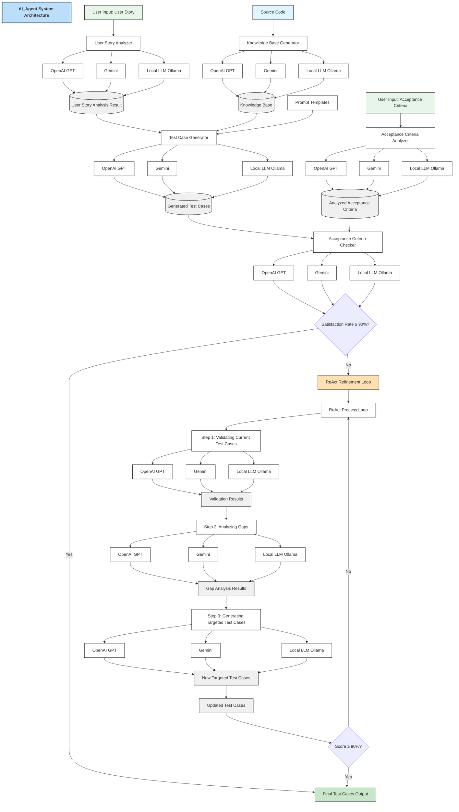

# AI_Agent System Architecture

```mermaid
graph TD

    %% Heading
    TITLE[AI_Agent System Architecture]
    
    %% Inputs
    U1[User Input: User Story]
    U2[User Input: Acceptance Criteria]
    SRC[Source Code]
    
    %% Knowledge Base Layer
    SRC --> KB[Knowledge Base Generator]
    KB --> B1[OpenAI GPT]
    KB --> B2[Gemini]
    KB --> B3[Local LLM Ollama]
    B1 --> KBDB[(Knowledge Base)]
    B2 --> KBDB
    B3 --> KBDB
    
    %% User Story Analysis Layer
    U1 --> USA[User Story Analyzer]
    USA --> E1[OpenAI GPT]
    USA --> E2[Gemini]
    USA --> E3[Local LLM Ollama]
    E1 --> USR[(User Story Analysis Result)]
    E2 --> USR
    E3 --> USR
    
    %% Test Case Generation Layer
    USR --> TCG[Test Case Generator]
    KBDB --> TCG
    TEMPL[Prompt Templates] --> TCG
    TCG --> G1[OpenAI GPT]
    TCG --> G2[Gemini]
    TCG --> G3[Local LLM Ollama]
    G1 --> TCS[(Generated Test Cases)]
    G2 --> TCS
    G3 --> TCS
    
    %% Acceptance Criteria Layer
    U2 --> ACA[Acceptance Criteria Analyzer]
    ACA --> K1[OpenAI GPT]
    ACA --> K2[Gemini]
    ACA --> K3[Local LLM Ollama]
    K1 --> ACR[(Analyzed Acceptance Criteria)]
    K2 --> ACR
    K3 --> ACR
    
    %% Validation & Refinement Layer
    TCS --> ACC[Acceptance Criteria Checker]
    ACR --> ACC
    ACC --> M1[OpenAI GPT]
    ACC --> M2[Gemini]
    ACC --> M3[Local LLM Ollama]
    M1 --> N{Satisfaction Rate ≥ 90%?}
    M2 --> N
    M3 --> N
    
    N -->|Yes| OUT[Final Test Cases Output]
    N -->|No| REACT[ReAct Refinement Loop]
    
    %% ReAct Process Loop
    REACT --> Q[ReAct Process Loop]
    Q --> R[Step 1: Validating Current Test Cases]
    R --> R1[OpenAI GPT]
    R --> R2[Gemini]
    R --> R3[Local LLM Ollama]
    R1 --> S[Validation Results]
    R2 --> S
    R3 --> S
    
    S --> T[Step 2: Analyzing Gaps]
    T --> T1[OpenAI GPT]
    T --> T2[Gemini]
    T --> T3[Local LLM Ollama]
    T1 --> U[Gap Analysis Results]
    T2 --> U
    T3 --> U
    
    U --> V[Step 3: Generating Targeted Test Cases]
    V --> V1[OpenAI GPT]
    V --> V2[Gemini]
    V --> V3[Local LLM Ollama]
    V1 --> W[New Targeted Test Cases]
    V2 --> W
    V3 --> W
    
    W --> X[Updated Test Cases]
    X --> Y{Score ≥ 90%?}
    Y -->|No| Q
    Y -->|Yes| OUT
    
    %% Styling
    style TITLE fill:#bbdefb,stroke:#000,stroke-width:2px,font-size:16px,font-weight:bold
    style U1 fill:#e8f5e9,stroke:#000,stroke-width:1px
    style U2 fill:#e8f5e9,stroke:#000,stroke-width:1px
    style SRC fill:#e1f5fe,stroke:#000,stroke-width:1px
    style OUT fill:#c8e6c9,stroke:#000,stroke-width:1px
    style REACT fill:#ffe0b2,stroke:#000,stroke-width:1px
    style KB fill:#fff,stroke:#000,stroke-width:1px
    style USA fill:#fff,stroke:#000,stroke-width:1px
    style TCG fill:#fff,stroke:#000,stroke-width:1px
    style ACA fill:#fff,stroke:#000,stroke-width:1px
    style ACC fill:#fff,stroke:#000,stroke-width:1px
    style KBDB fill:#f0f0f0,stroke:#000,stroke-width:1px
    style USR fill:#f0f0f0,stroke:#000,stroke-width:1px
    style TCS fill:#f0f0f0,stroke:#000,stroke-width:1px
    style ACR fill:#f0f0f0,stroke:#000,stroke-width:1px
    style TEMPL fill:#fff,stroke:#000,stroke-width:1px
    style B1 fill:#fff,stroke:#000,stroke-width:1px
    style B2 fill:#fff,stroke:#000,stroke-width:1px
    style B3 fill:#fff,stroke:#000,stroke-width:1px
    style E1 fill:#fff,stroke:#000,stroke-width:1px
    style E2 fill:#fff,stroke:#000,stroke-width:1px
    style E3 fill:#fff,stroke:#000,stroke-width:1px
    style G1 fill:#fff,stroke:#000,stroke-width:1px
    style G2 fill:#fff,stroke:#000,stroke-width:1px
    style G3 fill:#fff,stroke:#000,stroke-width:1px
    style K1 fill:#fff,stroke:#000,stroke-width:1px
    style K2 fill:#fff,stroke:#000,stroke-width:1px
    style K3 fill:#fff,stroke:#000,stroke-width:1px
    style M1 fill:#fff,stroke:#000,stroke-width:1px
    style M2 fill:#fff,stroke:#000,stroke-width:1px
    style M3 fill:#fff,stroke:#000,stroke-width:1px
    style R1 fill:#fff,stroke:#000,stroke-width:1px
    style R2 fill:#fff,stroke:#000,stroke-width:1px
    style R3 fill:#fff,stroke:#000,stroke-width:1px
    style T1 fill:#fff,stroke:#000,stroke-width:1px
    style T2 fill:#fff,stroke:#000,stroke-width:1px
    style T3 fill:#fff,stroke:#000,stroke-width:1px
    style V1 fill:#fff,stroke:#000,stroke-width:1px
    style V2 fill:#fff,stroke:#000,stroke-width:1px
    style V3 fill:#fff,stroke:#000,stroke-width:1px
    style Q fill:#fff,stroke:#000,stroke-width:1px
    style R fill:#fff,stroke:#000,stroke-width:1px
    style S fill:#f0f0f0,stroke:#000,stroke-width:1px
    style T fill:#fff,stroke:#000,stroke-width:1px
    style U fill:#f0f0f0,stroke:#000,stroke-width:1px
    style V fill:#fff,stroke:#000,stroke-width:1px
    style W fill:#f0f0f0,stroke:#000,stroke-width:1px
    style X fill:#f0f0f0,stroke:#000,stroke-width:1px
```
